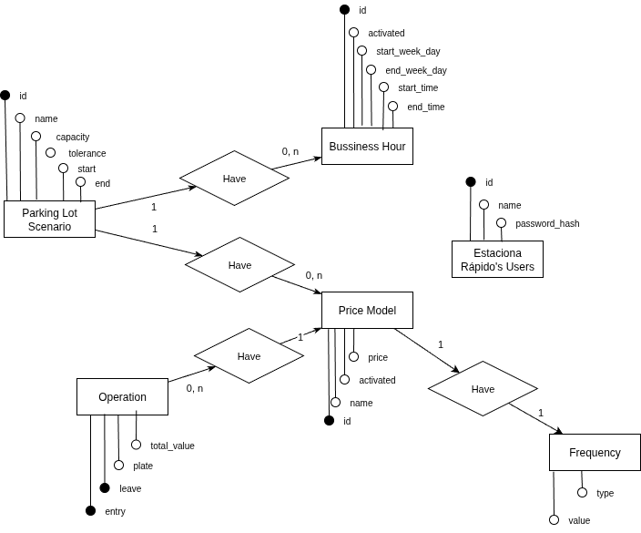
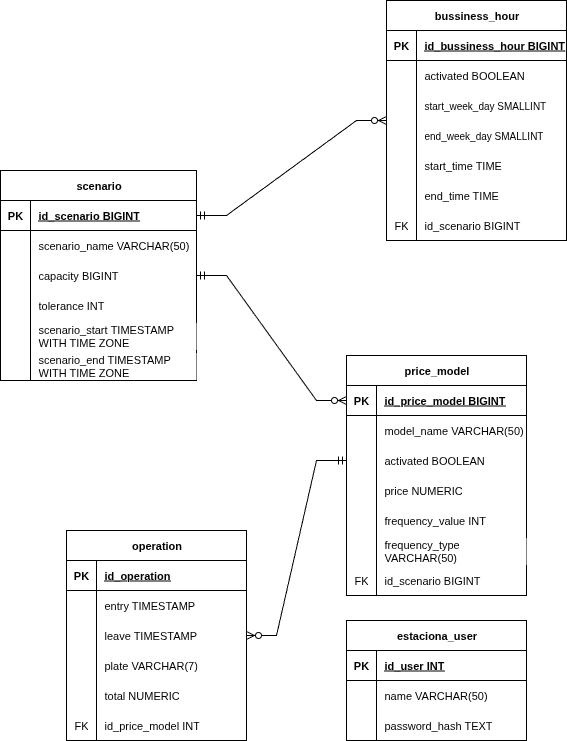

# Modelagem do Banco de Dados

Toda a modelagem foi feita através de um software de diagramação chamado Draw.io. O arquivo foi disponibilizado [aqui](../assets/diagramas.drawio) e através dele é possível realizar suas próprias alterações através do [site do Draw.io ou aplicativo](https://www.drawio.com/).

## Lógica



## Física




```sql
CREATE TABLE scenario (
    id_scenario BIGINT PRIMARY KEY GENERATED ALWAYS AS IDENTITY,
    scenario_name VARCHAR(50) NOT NULL,
    capacity BIGINT NOT NULL CHECK (capacity > 0),
    tolerance INT NOT NULL DEFAULT 15,
    scenario_start TIMESTAMP WITH TIME ZONE NOT NULL,
    scenario_end TIMESTAMP WITH TIME ZONE NOT NULL
);

CREATE TABLE business_hour(
    id_business_hour BIGINT PRIMARY KEY GENERATED ALWAYS AS IDENTITY,
    activated BOOLEAN NOT NULL DEFAULT TRUE,
    start_week_day SMALLINT NOT NULL CHECK (start_week_day > 0 AND start_week_day < 8),
    end_week_day SMALLINT NOT NULL CHECK (end_week_day > 0 AND end_week_day < 8),
    start_time TIME WITHOUT TIME ZONE NOT NULL,
    end_time TIME WITHOUT TIME ZONE NOT NULL,
    id_scenario BIGINT NOT NULL REFERENCES scenario (id_scenario)
);

CREATE TABLE price_model(
    id_price_model BIGINT PRIMARY KEY GENERATED ALWAYS AS IDENTITY,
    model_name VARCHAR(50) NOT NULL,
    activated BOOLEAN NOT NULL DEFAULT TRUE,
    price NUMERIC(38,2) NOT NULL CHECK (price > 0),
    frequency_value INT NOT NULL DEFAULT 1 CHECK(frequency_value > 0),
    frequency_type VARCHAR(50) NOT NULL DEFAULT 'HOUR',
    id_scenario BIGINT NOT NULL REFERENCES scenario (id_scenario)
);

CREATE TABLE operation(
    id_operation BIGINT PRIMARY KEY GENERATED ALWAYS AS IDENTITY,
    operation_entry TIMESTAMP WITH TIME ZONE NOT NULL,
    operation_leave TIMESTAMP WITH TIME ZONE,
    plate VARCHAR(7) NOT NULL CHECK (plate ~ '[A-Z]{3}[0-9]{4}' OR plate ~ '[A-Z]{3}[0-9][A-Z][0-9]{2}'),
    total NUMERIC(38,2) CHECK (total > -1),
    id_price_model BIGINT NOT NULL REFERENCES price_model (id_price_model)
);

CREATE TABLE estaciona_role(
    id_role INT PRIMARY KEY GENERATED ALWAYS AS IDENTITY,
    role_name VARCHAR(50) NOT NULL UNIQUE
);

CREATE TABLE estaciona_user(
    id_user INT PRIMARY KEY GENERATED ALWAYS AS IDENTITY,
    name VARCHAR(50) NOT NULL,
    password_hash TEXT NOT NULL
);

CREATE TABLE estaciona_user_role(
    id_user_role INT PRIMARY KEY GENERATED ALWAYS AS IDENTITY,
    id_user INT NOT NULL REFERENCES estaciona_user (id_user),
    id_role INT NOT NULL REFERENCES estaciona_role (id_role)
);
```