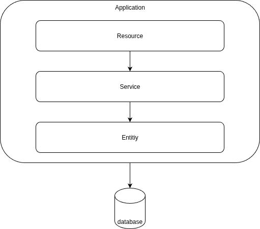

# Visão Geral

Os ambientes e os diferentes componentes da aplicação (frontend, backend, banco de dados) devem estar isolados em contâineres Docker, permitindo assim mais fácil execução em diferentes infraestruturas de tecnologia. A orquestração dos contâineres é realizado pelo `docker compose`.

## Backend
O backend deve ser escrito em Java, utilizando-se do framework Quarkus. Esse framework facilita alguns tipos de arquitetura, inclindo MVC, n-camadas e microserviços.

A arquitetura escolhida para a construção do backend foi o de 3 camadas, como pode ser visto na imagem abaixo:

* Entity: responsável por mapear as entidades no banco de dados para classes Java a partir do Hibernate ORM, mais especificamente pela biblioteca Jakarta.
* Service: realiza a implementação das regras de negócio e processamento de cálculos.
* Resource: é o ponto de entrada principal do usuário com a aplicação, recebendo e enviando mensagens REST.

A autenticação ficará em um repositório separado, mas seguindo a mesma arquitetura.

<!-- Testes de integração em cada endpoint do backend deve ser implementado antes do desenvolvimento do endpoint.
Os testes devem ser implementados numa esteira de integração e deploy contínuo. -->