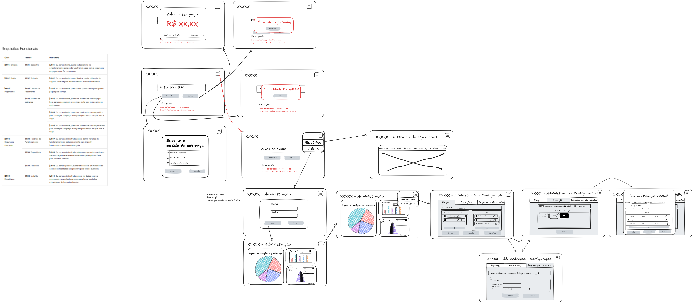

# Protótipo de baixa fidelidade

O protótipo de alta fidelidade foi feito no Excalidraw, um quadro branco virtual.

Para produzir sua própria versão do protótipo, você pode [baixar o arquivo](../../assets/prototipo_baixa.excalidraw) e abri-lo no [site deles](https://excalidraw.com/). Caso deseje só observar, pode ver a imagem resultante abaixo.

